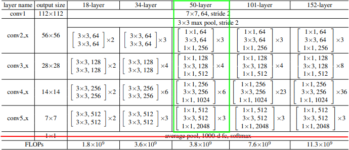
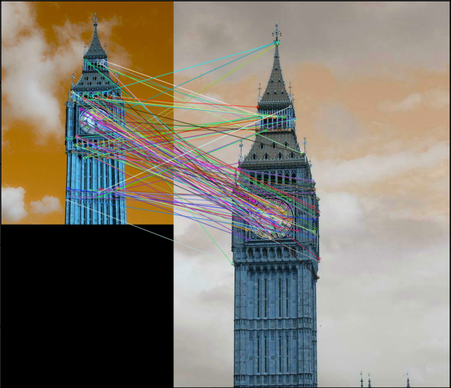
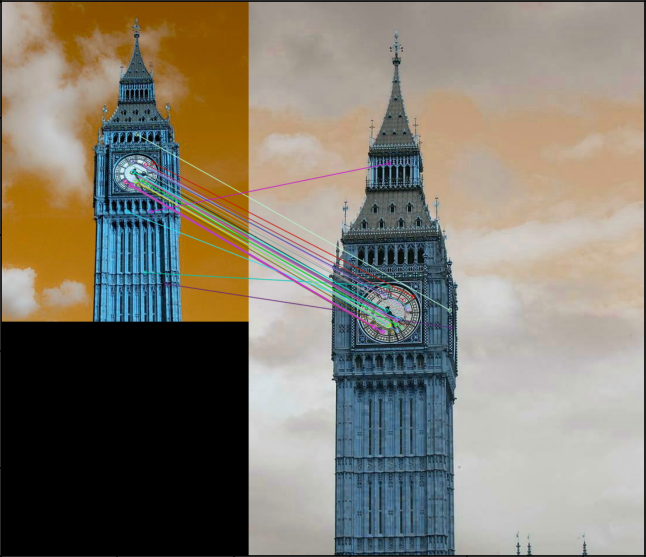
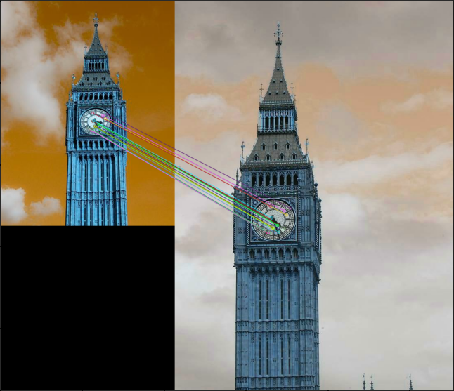
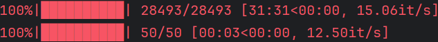
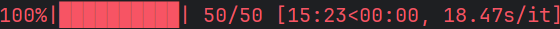
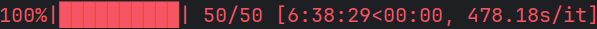

# Abstract
Given a collection of 28,493 images and 50 testing query images with bounding boxes, retrieve the ten most similar images for a query image from the collection of images. The task is implemented by two object matching methods. One method is based on the deep neural network ResNet-50, the other is based on Oriented FAST and Rotated BRIEF (ORB). The retrieval results are exhibited in two text files by using two methods separately. Each text file contains 50 rows, each row lists the names of the top ten matching images in descending order of similarity for a query image.

## Method Based on ResNet-50
### Ⅰ. Use Pre-trained ResNet-50 Model from PyTorch
The torchvision.models subpackage contains definitions of models for addressing different tasks. Residual Network (ResNet) was introduced in the paper [Deep Residual Learning for Image Recognition](https://arxiv.org/abs/1512.03385). It has been generally used in different applications for feature extracting.

### Ⅱ. Get the Feature Extractor from Pre-trained ResNet-50 model
In terms of feature extracting task, get the feature extractor by dropping the final fully connected layer and set it to the eval mode.

<table>
  <tr>
    <td width="100%">
       
      <strong>Green</strong>: ResNet-50 without the final fully connected layer.
    </td>
  </tr>
</table>

### Ⅲ. Preprocess the Input Image
ResNet-50 is pre-trained on ImageNet-1k at resolution 224×224. A combined transform for the input image including resizing, interpolation and normalization is necessary. For more details, please refer to [PyTorch documentation](https://docs.pytorch.org/vision/0.18/models/generated/torchvision.models.resnet50.html).

### Ⅳ. Extract Feature
Extract features of 28,493 images and save them separately. Each feature file corresponds to an image.

### Ⅴ. Handle a query image with multiple bounding boxes
Crop the query image with them and get corresponding cropped images. Extract features of cropped images and save them together as a feature file for the next procedure.

### Ⅵ. Compute Similarity and Rank
Since the architecture of deep neural network, the output tensor has 2048 features. After flattening, the similarity of two images can be computed by simply using cosine similarity.

As mentioned before, a query image can correspond to several features. Compute similarity respectively with each feature and select the maximum for a matching feature.

For each query image, rank the top ten matching images by comparing similarity.

## Method Based on ORB
### Ⅰ. Initialize ORB Feature Detector
ORB, a combination of two algorithms FAST and BRIEF, was created as an alternative to SIFT or SURF and is computed an order of magnitude faster than either, while performing as well in many situations. Due to the high efficiency, it has been widely applied in real-time scenarios.

OpenCV provides an off-the-shelf function to create an ORB feature detector. With FAST keypoint detector and BRIEF descriptor, it is available to figure out pairs of keypoint and descriptor. In the case of feature extraction, a pair of keypoint and descriptor is considered as a feature, enabling efficient matching between two images.

### Ⅱ. Set up FLANN-based Matcher with Parameters for Locality-Sensitive Hashing
Fast Library for Approximate Nearest Neighbors (FLANN) is a library for performing fast approximate nearest neighbor searches in high dimensional spaces. Locality-sensitive hashing (LSH) is a widely popular technique used in approximate nearest neighbor (ANN) search. As linear search is too costly, this can be orders of magnitude faster, while still providing near-optimal accuracy. In order to facilitate efficient matching of feature descriptors, building a FLANN-based matcher with LSH parameters offered by OpenCV does help reduce computing time.

### Ⅲ. Apply K-nearest Neighbors Matching and Lowe’s Ratio Test
After feature descriptors of two images are sorted out, the K-nearest neighbors (k=2) matching is performed by using the FLANN matcher. Plus, a ratio test according to Lowe’s paper is applied to filter out poor matches based on the distance of the two closest matches. It turns out that there are few matches stand for possibly similar features between two images.

<table>
  <tr>
    <td width="50%">
       
      ORB with Brute-Force Matcher.
    </td>
    <td width="50%">
       
      ORB with FLANN-based Matcher and Ratio Test.
    </td>
  </tr>
</table>

### Ⅳ. Measure Similarity and Rank with the Number of Inliers by Homography Estimation with RANSAC
When it comes to compare similarity, the number of matches could be considered as a reasonable measurement of similarity. But there is a more accurate assessment method.

Homography is a transformation that maps points from one plane to another. Keypoints of filtered matches can be used for calculating the homography matrix with Random Sample Consensus (RANSAC) algorithm, which iteratively selects random samples of keypoints, computes a homography matrix, drop unreliable matches caused by noise or incorrect feature correspondences, and evaluates how many of the remaining keypoints are effective (inliers). Thus, the count of inliers indicates the strength of similarity.

By the way, for matches whose number is not enough to generate a homography matrix, which means the two images have a limited number of similar features, the similarity should be minimized. In this case, set the count of inliers to zero.

<table>
  <tr>
    <td width="100%">
       
      ORB with FLANN-based Matcher and Ratio Test using RANSAC to filter out outliers.
    </td>
  </tr>
</table>

Eventually, for each query image, rank the top ten matching images by comparing the count of inliers. A higher count suggests that more features correspond precisely between the query one and the matching one.

## Result and Analysis
The result of ResNet-50 method is listed in a text file named “rank_list_resnet50.txt”. The result of ORB method is listed in a text file named “rank_list_orb.txt”.

The two rank lists are plotted intuitively in two images “rank_list_resnet50.png” and “rank_list_orb.png”.

<table>
  <tr>
    <td width="50%">
       
      rank_list_resnet50.png
    </td>
    <td width="50%">
       
      rank_list_orb.png
    </td>
  </tr>
</table>

As for retrieval time, ResNet-50 method runs much faster than ORB method by using extracted features in advance and pre-trained weights. But the performance really depends on the tuned model.

<table>
  <tr>
    <td width="50%">
       
      Feature extracting time of ResNet50 method. 
       
      Retrieval time of ResNet50 method.
    </td>
    <td width="50%">
       
      Retrieval time of ORB method.
    </td>
  </tr>
</table>

## References
[1]	K. He, X. Zhang, S. Ren, and J. Sun, “Deep Residual Learning for Image Recognition,” in *Proceedings of the IEEE Conference on Computer Vision and Pattern Recognition (CVPR)*, Las Vegas, NV, USA, Jun. 2016, pp. 770-778.

[2]	E. Rublee, V. Rabaud, K. Konolige, and G. Bradski, “ORB: An efficient alternative to SIFT or SURF,” in *Proceedings of the IEEE International Conference on Computer Vision (ICCV)*, Barcelona, Spain, Nov. 2011, pp. 2564-2571.

[3]	D. G. Lowe, “Distinctive Image Features from Scale-Invariant Keypoints,” *International Journal of Computer Vision*, vol. 60, no. 2, pp. 91-110, Nov. 2004.

[4]	M. Muja and D. G. Lowe, “Fast Approximate Nearest Neighbors with Automatic Algorithm Configuration,” in *Proceedings of the International Conference on Computer Vision Theory and Applications (VISAPP)*, 2009.

[5]	P. Indyk and R. Motwani, “Approximate nearest neighbors: towards removing the curse of dimensionality,” in *Proceedings of the 30th Annual ACM Symposium on Theory of Computing (STOC)*, New York, NY, USA, 1998, pp. 604-613.

[6]	M. A. Fischler and R. C. Bolles, “Random sample consensus: a paradigm for model fitting with applications to image analysis and automated cartography,” *Communications of the ACM*, vol. 24, no. 6, pp. 381-395, Jun. 1981.
